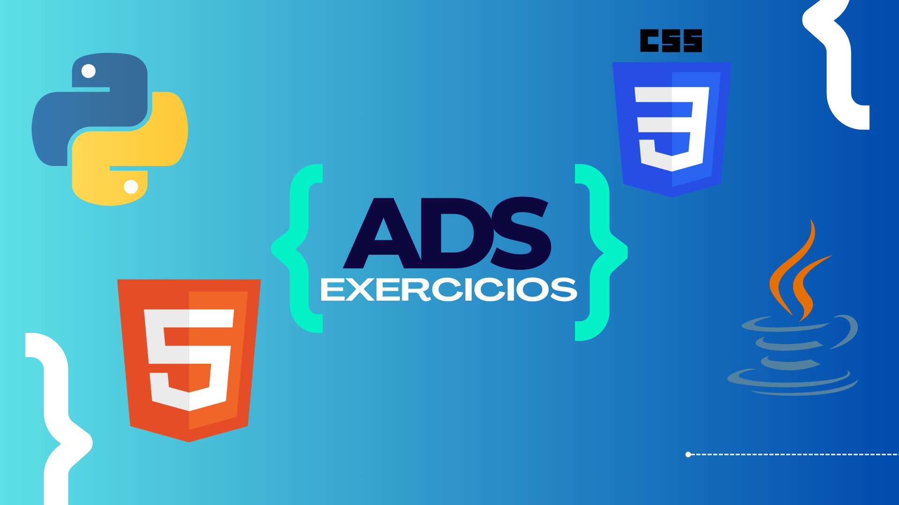

<h1 align="center">
  ADS Exercicios
</h1>

  <!--  -->
  
  
  
  

  
  
  

  

#####

📦Repositório dos exercícios de **Python** e **Java** do ADS.

<!-- > **Link do projeto:** [🔗Clique aqui para acessar](https://saulojustiniano1.github.io/esports-community) -->

###

**✏️Linguagens:**

- [Python](https://www.python.org/)
- [Java](https://docs.oracle.com/javase/8/docs/api/)

**🚀Tecnologias:**

- [Intellij IDEA](https://www.jetbrains.com/idea/)
- [Git](https://git-scm.com) | [GitHub](https://github.com)
